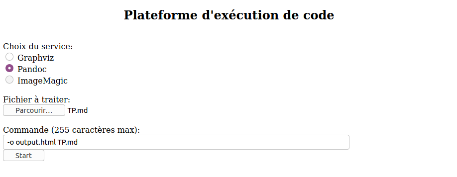

# TP RT0704 
## Mise en place de l'environnement de développement

### génération d'une clé RSA depuis l'hôte
* ssh-keygen -t rsa
### transfert de la clé publique de l'hôte sur l'invité
* ssh-copy-id -i ~/.ssh/id_rsa.pub user@172.18.10.20

### vérif de python3, pip3 et virtualenv
* sudo apt-get install python3 -y && sudo apt-get install python3-pip -y && sudo pip3 install virtualenv

### création du script hello-world

* vi hello-world.py

### exécution du script 
* python3 hello-world.py 

## Installation de docker

### Installez Docker sur la machine Virtuelle

* sudo apt install docker.io -y

### ajout de user au groupe docker (pas besoin de root pour docker)
* sudo usermod -aG docker user

### Testez l'installation de docker avec le conteneur **hello world**
* docker run hello-world

## Gestionnaire de file
### Téléchargez et exécutez un conteneur RabbitMQ

Activation du pluggin management (http) et forward du port 15672 du conteneur rabbitmq au port 8080 de l'ubuntu server (VM)

utilisateur par défaut:
* id=guest
* mdp=guest

commande:

* docker run -d --restart always --hostname rabbitmq-perso --name rabbitmq-perso -p 8080:15672 rabbitmq:3-management

## Flask

### Téléchargez et exécutez un conteneur Flask

Lancer un conteneur flash avec une redirection du port 8000 de l'invité sur le port 8081 de l'hote, le fichier app.py génère automatiquement le hello-world

* docker run -d --privileged --hostname conteneur-flask --name conteneur-flask  -p 8081:8000  altoning/flask3

accès OK via http://172.18.10.X:8081

### Modification du fichier app

Création d'un conteneur flask qui exécutera un shell /bin/bash

* docker run -a stdin -a stdout -a stderr -it --privileged --hostname conteneur-flask --name conteneur-flask  -p 8081:8000 altoning/flask3 /bin/bash

* vi app.py

Lancement du script  boot.sh

* /bin/bash boot.sh

### Créez une page web avec un template JINJA

Jinja 2 est déja installé

* mkdir templates
* vi templates/template1.html

* vi app.py

* python3 app.py

### Réalisez la création d'un couple formulaire / page de traitement exploitant JINJA

* vi templates/formulaire.html

* vi templates/traitement.html 

* vi app.py
 

 Page du formulaire:

 

 Page du traitement:

 

